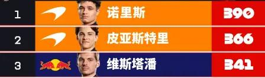
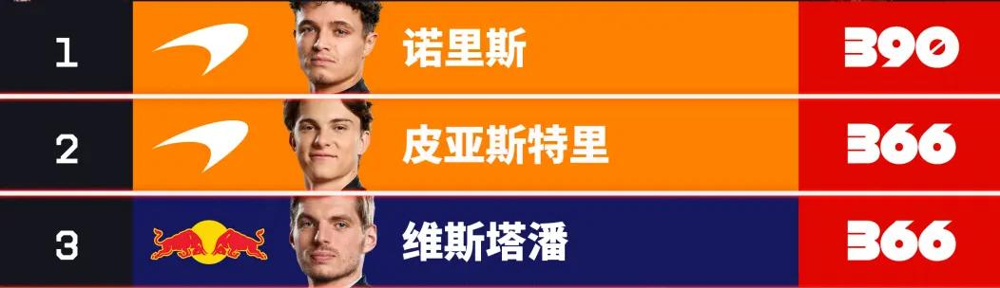
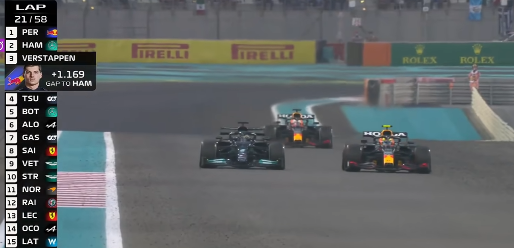
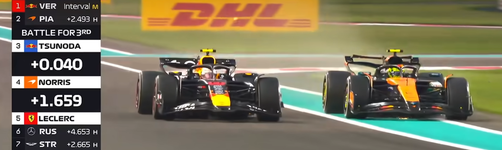

# 前情提要

## 和F1的初次相遇
我已经记不清是什么时候第一次知道F1了。但是真正让我开始对F1有所了解的，是2022年周冠宇加入阿尔法·罗密欧的消息。当时我想方设法找渠道看F1，最后发现实在太卡了没办法看（好像是五星体育），只好作罢。

在那以后，我对F1的关注就仅限于刷到相关的视频会点进去看看，直到《F1：狂飙飞车》的上映。

看完这部相当精彩的电影后，我对F1的热情得到了巨大的激发。从那之后的比赛，只要时间不是太过阴间，我都至少会点进去看一眼。[F1赛事资讯](https://space.bilibili.com/65125803/dynamic?spm_id_from=444.41.list.card_title.click)的视频更是期期不落。

可以说，从看完《F1：狂飙飞车》开始，我才算是入坑了F1。

## 阿布扎比站赛前
### 拉斯维加斯

这场比赛维斯塔潘夺冠，诺里斯亚军，皮亚斯特里第五。但迈凯伦因底板磨损双车DSQ。

### 卡塔尔

第8圈出现安全车，除迈凯伦以外全员进站换胎。由于强制两停，迈凯伦在进站中损失巨大。最终维斯塔潘夺冠，皮亚斯特里亚军，诺里斯第四。

# 终极一战
比赛的内容不必赘述，维斯塔潘再一次夺冠，皮亚斯特里第二，诺里斯第三并成为wdc。

因为维斯塔潘的疯狂追分，大多数人都更希望他取得三连冠。但迈凯伦的车毕竟是统治级的，大多数人也清楚，冠军归属于诺里斯的概率显然最大。但是，没有人不喜欢落后100多分成为wdc的故事，尤其是对于今年才开始看F1的新观众（大部分是和我一样被电影吸引而来的）来说，如果维斯塔潘夺冠，2025赛季无疑会成为一个难以忘怀的赛季。

但12分的差距毕竟还是难以逾越，没有人能阻止诺里斯登上领奖台。无论是开局尝试超车的勒克莱尔，努力阻挡却自己吃到罚时的角田裕毅，还是调查诺里斯对角田的超车但一无所获的FIA，迈凯伦的逆天策略在本场比赛也没有发生。

对诺里斯而言，他只要进入前三名；对维斯塔潘来说，他能做的有且只有跑到第一，剩下的，尽人事，听天命。难易程度可见一斑。

维斯塔潘在地效车的最后时代，以悲情英雄的面貌出现在领奖台上。迈凯伦的两位车手应该知道，他们还难望这位伟大车手的项背。

# 车重要还是人重要？
首先声明，以下讨论仅限于2025年车手世界冠军。

## 车手做了很多
毫无疑问，一名个人能力优秀的车手完全可以在赛道上发挥出色，获得更多的积分，为自己争取更多的争冠可能性。在同一车队中，两位车手的积分高低通常能显示出他们的实力差距。

即使是再优秀的一辆车，如果遇到的是平庸的驾驶员，它的潜能也无法全部被激发。没有人会否认车手在围场中的重要性，他们赋予赛车运动以生命和活力。

并且，由于车手是人，他们自然更立体，更真实可感，更有个性，也就会受人喜爱，吸引粉丝。我还没有见过自称某一辆车的粉丝的人，但车手粉丝已经是司空见惯。

因此，车手天然有着更高的关注度，他们无疑是围场的焦点。
## 问题来自火星车
车手世界冠军，从字面上来看，应当是表彰车手能力的荣誉。但是由于诸多原因，我们无法客观公正地评判车手的能力。

围场里20辆车，火星车、月球车、地球车之间有着不小的差距。车有快慢，车手的表现就有差异。因此，单纯用排名积分来衡量车手的能力显然是不合适的。

这样看来，车手世界冠军似乎并没有那么高的含金量。是这样吗？

## 车队做了很多
### 造车
显然，车队最重要的工作之一就是造出一辆好车。“好”的评判标准相当多元化：动力、抓地力、转向、空气阻力、离地距离......即使是像我这样的赛车门外汉，也说得出来相当多的角度。

不仅是在赛季初造出一辆车，赛季进行中的调整和升级也相当重要。这需要车手和工程师的通力合作。

### 团队合作
最知名的例子之一就是2021年阿布扎比站的“Checo is a legend”。佩雷兹的神奇防守让汉密尔顿失去了安全车下的进站窗口，帮助维斯塔潘夺得wdc。

F1的团队合作多数时候体现在队友之间，二号车手辅助一号车手拿到更好的名次。正因如此，二号车手对于争夺wdc功不可没。

值得一提的是，红牛二号车手角田裕毅在本场比赛时面对诺里斯的追进，在TR中充满信念感地说出"I know what to do"，如同热血动漫的男主一般。

然后他就被诺里斯轻松超过，令人忍俊不禁。[^1]

### 策略
策略包括进站策略（比如undercut和overcut[^2]）、轮胎策略等等，对于某些队伍来说是绝对的软肋。[^3]

好的策略可以扭转赛车性能和车手能力的差距，差的策略同样可以扭转赛车性能和车手能力的差距。红牛的策略师汉娜在策略方面堪称权威，围场中也存在一些有能力自己做策略的车手。

### 其他的事
除此之外，车队做的还有很多，比如营销、拉赞助、人才流动、青训、拍摄......其中一部分与车手的比赛内容无关，一部分辅助车手的比赛，在这里不再赘述。

# WDC不只是车手的荣誉？
从上面的讨论中，我们不难发现：在wdc的争夺中，车手和车队都起到了相当大的作用，但毕竟这是车手世界冠军，观众更愿意把这份荣誉安在车手而非车队身上，车手对车队的感谢也更多地被认为是客套话。

但赛车和车队的贡献同样不容忽视，这也就带来了另一个老生常谈的话题：如果是XXX开这辆车，XXX就能/不能拿冠军了。

## 关公战秦琼
显然，这样的讨论的确非常有趣，讨论空间也相当大。但这样的议题终究没有结果，毕竟维斯塔潘不会真的开上mcl39[^4]，没有人知道结果如何。

当然，这也正是这类话题的独特之处。比战力是从古至今全世界人民的一大爱好，没有人不喜欢发挥自己的想象力思考一个不可能发生但充满魅力的议题。

## 一个暴论：wdc争夺本身就是不公平的竞赛
上文已经谈到了很多wdc竞争中的影响因素，我们不难注意到，wdc所牵扯的方方面面实在是太过复杂，没有办法一言以蔽之。在车手本身之外，车队的制造水平、策略水平，还有意料之外的情况（比如底板磨损导致的DSQ）都会对wdc之争造成具有决定性和戏剧性的影响。

或许，从wdc出现之初，它就无法成为，也没有被计划设计成为公平公正的荣誉竞争。和英雄联盟的S赛一样[^5]，永远保持戏剧性，提供娱乐性，才是这类竞技的初衷。公平公正，会减少戏剧效果，会影响收视率，会让观众越来越少。

这篇文章得出的结论就是这样：F1是不公平的运动，wdc的争夺是不公平的竞赛，这是为了F1的长期发展，也是为了赛事的良性运营。

## 其实，硬要说wdc只属于车手，也不是不行
车手在每个赛季初的转会期对队伍的选择，甚至青训时期对队伍的选择，其实也决定了他们未来争夺wdc的可能性。

当然，这样说是纯粹的暴论，因为转会期的结果并不完全由车手自己决定。

就像我们的命运，也不是时时刻刻都掌握在自己手中。

> 人生到处知何似，应似飞鸿踏雪泥。
> 
> 泥上偶然留指爪，鸿飞那复计东西。
> 
> 老僧已死成新塔，坏壁无由见旧题。
> 
> 往日崎岖还记否，路长人困蹇驴嘶。

[^1]: 从图中可以看到这里NOR的超越超出了赛道范围，但FIA认为角田挤压在先，没有处罚NOR

[^2]: 主播主播 什么是undercut 什么是overcut？所谓undercut和overcut都是使用进站完成超车的策略 所谓的undercut指的是比对手早进站 让自己的排名先under 然后用新胎做出很快的圈速 在对手完成换胎出站之后排在对手的前面完成超车 所谓的overcut指的是在对手进站之后仍然留在赛道上 让自己的排名先over 然后用旧胎做出比对手更快的圈速 在自己进站之后出站 排在对手前面完成超车

[^3]: 这里并不特指法拉利，因为迈凯伦的操作同样逆天

[^4]: 这样的话题中通常包含为维斯塔潘鸣不平的粉丝们。每个车手的粉丝都会这样，这里仅仅是用他举个例子。笔者在这里对这种行为不做评价，作为普通观众，这样的讨论显然具有其合理性

[^5]: 直到2025年的S15，lol的S赛仍然从8强战开始采用单败淘汰制
