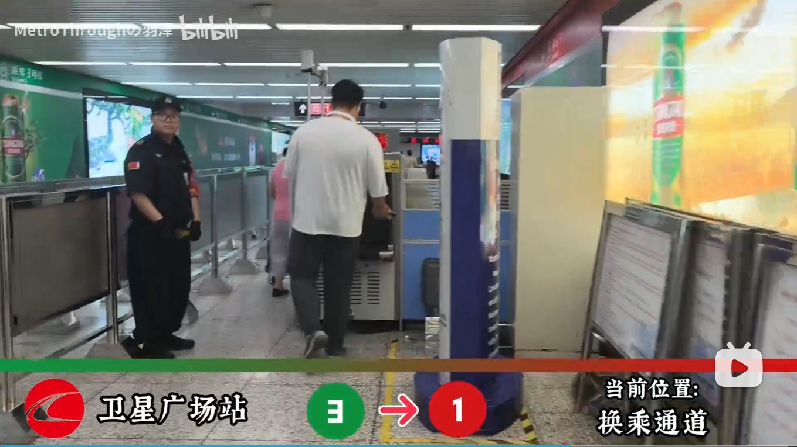
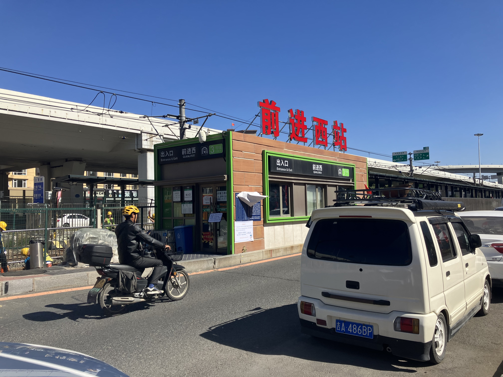

# 一、轨道交通的换乘经历
## 长春三号线：轻轨？地铁？
2026年的元旦，我到长春找高中同学玩。

12月31号下午，我们结束在净月潭的游玩，准备去欧亚卖场。途中搭乘3号线、1号线、6号线。

## 净月潭公园站

净月潭公园站[^1]位于地面之上，轨道和候车区位于建筑的二层，检票和安检位于一层。值得一提的是，一层还有几家餐饮类店铺，生意应该还不错。

作为地上的轨道交通，3号线的构造让我想到了青岛的蓝谷快线。同样是下层检票上层坐车，它们之间的一个明显区别就在于安检的程度。蓝谷快线的安检与一般地铁无异，但长春3号线作为轻轨，其安检仅限于用探测器随便扫扫。

## 卫星广场站
但是，直到我们在卫星广场站下车，换乘至1号线的时候，我才发现事情的不对劲。
 

如图[^2]，从3号线（轻轨）换乘至1号线（地铁）需要额外进行一次安检！

换乘通道中有手持探测器的工作人员以及一台X射线安检机，完全是地铁的安检流程。

我认为，是轻轨的安检标准低于地铁，才导致了轻轨换乘地铁需要再进行一次安检。
# 二、安全标准的问题？
## 交通运输部的规定
2018年5月21日发布的《城市轨道交通运营管理规定》[^3]（以下简称《规定》），明确指出其使用范围同时包括地铁和轻轨。

> 第二条 地铁、轻轨等城市轨道交通的运营及相关管理活动，适用本规定。

其中指出：

> 第三十六条 禁止乘客携带有毒、有害、易燃、易爆、放射性、腐蚀性以及其他可能危及人身和财产安全的危险物品进站、乘车。运营单位应当按规定在车站醒目位置公示城市轨道交通禁止、限制携带物品目录。
> 第三十七条 各级城市轨道交通运营主管部门应当按照职责监督指导运营单位开展反恐防范、安检、治安防范和消防安全管理相关工作。
> 鼓励推广应用安检新技术、新产品，推动实行安检新模式，提高安检质量和效率。

虽然内容写的相对宽泛，但是我们能够领会到《规定》中期望地铁、轻轨等城市轨道交通的安检标准统一的内涵。
## 安检互认是大势所趋
2025年4月8日，交通运输部印发的《城市轨道交通客运组织与服务管理办法》[^4]指出：

> 第十一条  ......与火车站、汽车客运站、机场等相衔接的车站，应加强信息共享、标志接续、流线衔接等服务协同，提供的安检场地应为安检互认提供便利，以减少重复安检，提高通行效率和服务水平。

在青岛北站，从2025年初开始就已经实现了青岛北站与青岛地铁的安检单方互认，也就是高铁换乘地铁无须再次安检。这与长春的现状很类似：3号线换乘1号线要安检，但1号线换乘3号线却不需要。

高铁的安检标准显然要高于地铁，以此类推，轻轨的安检标准应该是低于地铁才会导致上述的情况。

然而，同样是青岛，我前文中提及的蓝谷快线虽然也在地上，和长春3号线的模式相似，安检却与一般地铁无异，换乘也不需要再次安检。

为什么会这样？
# 三、长春3号线的特殊之处
## 时间是个问题
> 2000年5月27日，长春轻轨一期工程正式开始建设，北段线位（长春站—南湖大路）大致与长大铁路平行。2002年10月30日长春轨道交通3号线一期工程通车试营运，运行区间为长春站—卫光街，时称长春轻轨1号线。2007年4月3日全线贯通运行至长影世纪城站。[^5]

长春3号线是全国最早的一批城市轻轨，2000年开工建设，2007年全线贯通。当时的很多设计，放到现在都显得相当落后。

以前进西站[^6]为例：

> 车站位于卫星路主路与南侧辅路之间，设有两个地面[侧式月台](https://zh.wikipedia.org/wiki/%E4%BE%A7%E5%BC%8F%E6%9C%88%E5%8F%B0 "侧式月台")，并分别设置雨棚。车站于南侧站台西端朝向辅路设置出入口站房。本站未设置换向天桥或地下通道，换向乘客及往长春站方向乘客进站后需通过站内东端平过道换向。[^7]

极为狭小的站房，夸张的换向方式，几乎不存在的安检......

事实上，3号线的地上部分很多都相当简陋，更不要提现代地铁式的安检了。当时全国的轨道交通没有现在这么完善与常见，也没有现在这样的安检体系，像这样简陋的安全检查普遍存在于各地的轨道交通，无安检、弱安检才是常态。

时代变迁，后来建设的轻轨和地铁都有着和今天一样比较高的安检标准。但3号线这样的早期建设的产物，只能稍微打打补丁，尽可能满足最低要求。

又或者，像3号线自己的三期东延工程一样，直接推倒重来，改造成地下的岛式站台，完全与地铁接轨。但这需要巨大的开支。
## 低风险的地上建筑
位于地下的地铁是一个密闭的空间，一旦发生事故，疏散和处理都面临着不小的困难。

位于地上的轻轨相对开放，人员疏散更容易，处理事故更简单。

因此，地上的轻轨风险等级较低，也就不必要地下轨道交通那样繁复的安检程序。
## 几乎开放式的站台
尤其是地面上的一期工程，站台和轨道直接与路面在同一平面上，只靠护栏分隔。在这样的条件下，想要再补充完善的、封闭式的安检体系，绝对不是容易的事。

对于这样的站台，完全的筛查并无可行性与必要性，稍稍注意明显的危险品，就足以支撑起安全检查的全部内容了。
# 四、换乘通道的再次安检
3号线有着这样那样的难处，但其他线路并不是这样。

1号线就是我们所熟悉的地铁线路，安全标准也是一般地铁的标准。对于1号线而言，一个从3号线走下来的乘客，他的安全状态是一个完全的未知数。因此，再次安检就有了很大的必要。

本质上，换乘通道的再次安检体现的是：1号线不认可3号线的安全检查，但3号线认可1号线的安全检查（毕竟1号线标准高）。这是长春的轨道交通体系内部不统一的结果，而不能完全认为是轻轨与地铁的安全标准差异所导致。
# 五、和而不同
轻轨可以接受更低的安全标准、更高的事故风险（相对而言），但地铁不可以。它们之间可以实现票务互认，却无法实现安全互认。

地铁和轻轨，来源于不同的发展思路和时代背景，却在同一时空中存在与交汇，获得了一个相同的名字：“轨道交通”。如何让它们成为一个有机结合的整体，是一个不容小觑的命题。

> 和羹之美，在于合异。
> 上下之益，在于相济。

[^1]: [净月潭公园站 - Wikiwand](https://www.wikiwand.com/zh-cn/articles/%E5%87%80%E6%9C%88%E6%BD%AD%E5%85%AC%E5%9B%AD%E7%AB%99)

[^2]: [青泥洼桥站2.0？！]轨道交通换乘实录08——长春轨道交通卫星广场站3号线→1号线 换乘过程实录【轨道交通换乘实录】 https://www.bilibili.com/video/BV1UskuBLEd1

[^3]: [城市轨道交通运营管理规定_国务院部门文件_中国政府网](https://www.gov.cn/zhengce/zhengceku/2018-12/31/content_5444349.htm)

[^4]: [交通运输部关于印发《城市轨道交通客运组织与服务管理办法》的通知](https://xxgk.mot.gov.cn/2020/xzgfxwj/202504/t20250414_4166933.html)

[^5]: [长春轨道交通 - 维基百科，自由的百科全书](https://zh.wikipedia.org/wiki/%E9%95%BF%E6%98%A5%E8%BD%A8%E9%81%93%E4%BA%A4%E9%80%9A)

[^6]: 图源：作者 Air7538 - 自己的作品，CC BY-SA 4.0，https://commons.wikimedia.org/w/index.php?curid=123111017

[^7]:  [前进西站 - 维基百科，自由的百科全书](https://zh.wikipedia.org/wiki/%E5%89%8D%E8%BF%9B%E8%A5%BF%E7%AB%99)
